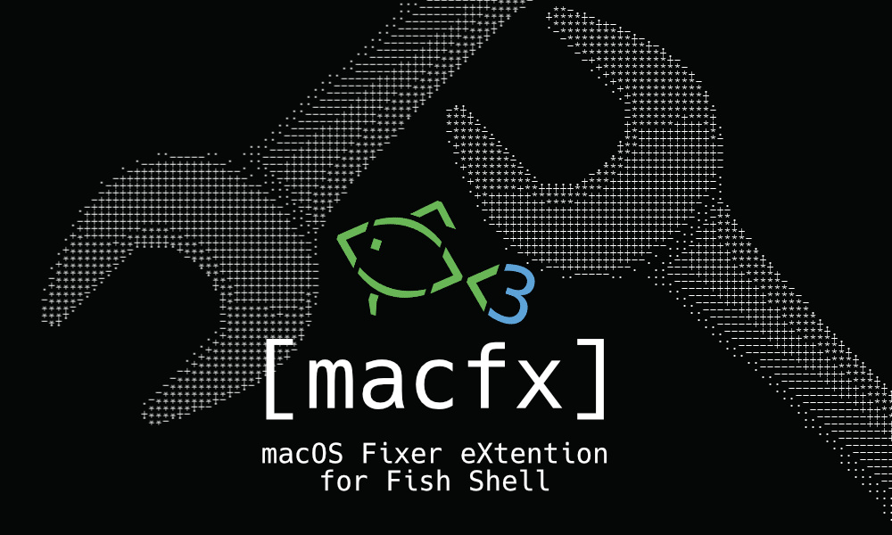

# macOS Fixer eXtention for Fish-Shell

**This project is completely open source, and I just want to give simple fixes for hard problems.**
Any commits will be checked for security and added to the project.

---

## Solve the problem in easy way

This script has a few sections, each with a set of commands to fix different problems that I come across from time to time.

For example, after an update, the "discord" command resubscribes the app and we can see all our audio/video devices connected to Discord.
"xattr" is a simple solution if an app isn't launching for various reasons.
"msf" adds MSF support to fish 3.\*

In the "Updates" section, there are three commands to update the system. "update_all" updates all available updates, "locate_up" updates the locate database, and "fish_up" updates fish completions via man.

In the "Services" section, there are two commands. "spell" is a spell-checking service, and "rdbug" restarts remote desktop services.

In the "System tools" section, there are three commands to perform tasks at the system level...
"rtcsnd" fixes RTC on hackintosh systems.
"tm" is a simple Timeshift cleaning manager.
"jenv" allows the user to view and select Java Environment.
